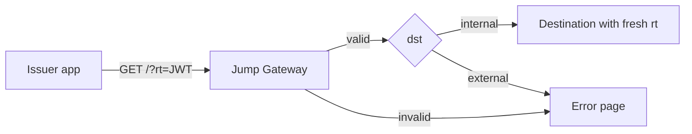

# UMAXICA Jump Gateway 0.3

Jump Gateway is a stateless redirect trust broker for
`https://jump.umaxica.net/?rt=<JWT>`. Hono on Cloudflare Workers production
verifies signed redirect instructions and allows only the approved source →
destination origin graph. The current identity is `https://jump.umaxica.net`,
supplied by required `UMAXICA_JUMP_ORIGIN`. No development authorities, receiver
emulator or other provider implementation is provided. Web Standard core
dependencies remain explicit.

Issuer applications create an `rt` compact JWS. Jump validates the JWT, issuer
registry, JWKS signature, destination policy and normalized URL before crossing
FQDN boundaries. Allowed internal destinations receive a 302 with a freshly
signed `rt`. Jump is internal-only: `dst: external` is always refused
([ADR 0007](adr/0007-remove-external-destinations.md)).

Issuer applications should fully understand the JWTs they generate.

## Purpose

Jump exists to make redirect decisions server-side at an edge boundary instead
of letting applications pass arbitrary URLs across domains. It reduces
OpenRedirect risk and makes the allowed source → destination graph explicit.

## EDGE Family

Jump was split out of the Umaxica edge monorepo. Sibling repositories:

- [umaxica-apps-edge](https://github.com/seahal/umaxica-apps-edge) — the edge
  monorepo the family was split from.
- **umaxica-apps-jump** (this repository) — controls the Umaxica TLD apex and
  prevents open redirects on its own.
- [umaxica-apps-edge-core](https://github.com/seahal/umaxica-apps-edge-core) —
  reserved for the TanStack Start system once it outgrows edge; not split out
  yet.
- [umaxica-apps-edge-away](https://github.com/seahal/umaxica-apps-edge-away) —
  planned standalone cushion pages for external destinations; no core yet.

## NON-GOALS

- This project is NOT an authentication provider.
- This project is NOT a session manager.
- This project is NOT a generic proxy.
- This project is NOT a URL shortener.
- This project is NOT a confidential transport.
- This project does NOT hide redirect destinations.
- This project does NOT replace OAuth/OIDC.
- This project does NOT grant authorization, CSRF approval or permission to
  execute a transaction.
- This project is ONLY a redirect trust broker across FQDN boundaries.

## Quick Flow



## Protocol Summary

Schema 1 intentionally requires `rpl: "reuse"` on both input and output. This is
an acceptance change from 0.1, despite the unchanged JWT schema. Every reuse
runs verification again and produces a fresh outbound `jti`.

0.3 tightens inbound structural TTL to 30 seconds; output remains 30 seconds.
See [ADR 0006](adr/0006-jump-0.3-hardening.md). The 0.2 plan and earlier ADRs
are frozen historical records, not current validation or CI status.

Read [protocol](docs/protocol.md), [receiver obligations](docs/receiver-contract.md),
[configuration](docs/operations/production-configuration.md),
[rotation](docs/operations/key-rotation.md), and [compatibility](docs/compatibility.md).
[Current plan and traceability](plans/jump-0.3-hardening.md) record scope and acceptance.
[ADR 0005](adr/0005-production-jump-0.2.md) supersedes historical provider/Leap contracts.

## Endpoints

| Path                                      | Purpose                                                        |
| ----------------------------------------- | -------------------------------------------------------------- |
| `/?rt=<JWT>`                              | Verify the instruction and redirect (`GET` only)               |
| `/`                                       | Without a query, redirects to `/about`                         |
| `/about`                                  | Human-readable description of the service                      |
| `/health`, `/health.json`, `/health.html` | Responsiveness and service version; `/health` follows `Accept` |
| `/.well-known/jwks.json`                  | Jump's public signing keys for receivers                       |
| `/robots.txt`, `/sitemap.xml`             | Crawler metadata                                               |
| `/favicon.ico`                            | Static asset                                                   |

## Requirements

Node `24.20.0` and pnpm `12.0.0`, as pinned in `package.json`. Other pnpm
versions stop with `ERR_PNPM_BAD_PM_VERSION`.

## Checks

```sh
pnpm install --frozen-lockfile
pnpm run format:check
pnpm run lint:check
pnpm run typecheck
pnpm run test
pnpm run test:cov
pnpm run test:e2e
pnpm run test:worker
pnpm run cloudflare:check
```

`cloudflare:check` is `wrangler deploy --dry-run`, with no upload. Local browser
and Worker tests use nonproduction generated keys and the production validation
rules. `test:worker` runs the built Worker under local workerd (Miniflare)
against the production origin graph.

Generate a nonproduction ES384 key pair into a new empty directory with
`pnpm run keys:generate -- <directory> [kid]`.

## Deployment Verification

`/health*` reports responsiveness and service version, not signer readiness.
There is no readiness endpoint; verify deployments with `/health.json`,
`/.well-known/jwks.json` and a signed RT smoke as described in
[deployment verification](docs/operations/deployment-verification.md).
Local evidence cannot prove production bindings, issuer reachability, receiver
compatibility or a safe rollback artifact. Rollout remains gated separately.

## Security Notes

Security is the core of Jump. Every redirect is a server-side decision made
after the instruction is proven to come from a registered issuer and to follow
an approved edge. Nothing in the request can widen that decision.

### Token parameters

- `rt` JWTs are NOT confidential. They intentionally appear in URLs, only as
  the `rt` query parameter, never in a pathname.
- `jti` identifies each JWT; schema 1 does not treat it as a single-use
  credential. Reuse is re-verified every time and yields a fresh outbound `jti`.
- `exp` guarantees time-based expiration. Inbound TTL is at most 30 seconds
  with 5 seconds of clock skew for "now" comparisons only; outbound TTL is
  exactly 30 seconds.
- Every claim is required and typed: `schema`, `rpl`, `iss`, `aud`, `sub`,
  `iat`, `nbf`, `exp`, `jti`, `dst`, `url`. No other claim is copied forward.

### Trust boundary: the origin graph

- The [protocol graph](docs/protocol.md) is the authorization boundary: 13
  registered origins and 20 allowed source → destination edges. All other
  ordered pairs are denied.
- The registry refuses duplicates, unknown references, self loops, TLD crossings
  and noncanonical origins when it is built. At runtime, self links and links
  back to Jump are refused even if the registry were too permissive.
- `dst` must be `internal`. External destinations are refused for every issuer;
  the cushion page is dormant code awaiting removal (ADR 0007 phase 3).

### Signature and key handling

- Only `ES384`, a `kid` of 1–128 characters without control characters, and
  the deployment's exact `typ` are accepted: `JWT` in production,
  `jump-request+jwt` in staging (outbound `jump-return+jwt`). The protected
  header may contain only `alg`, `kid` and `typ`; the claim set is closed.
  Compact tokens are limited to 4096 characters.
- Each issuer's JWKS URL is fixed at `<origin>/.well-known/jwks.json`. No token
  value ever selects a network destination. JWKS fetches bypass caches, refuse
  redirects and non-200 answers, accept only JWK Set or JSON media types, and
  stop reading at 64 KiB. A set must hold 1–4 ES384/P-384 `use: sig` keys or it
  is refused whole.
- Unverified decoding is used only for shape checks and key lookup. No
  authorization decision precedes signature verification.
- The Jump signing key is one active ES384 private key with an explicit public
  JWKS. Public keysets containing private fields are rejected, the active pair
  is probe-checked, and missing or alias-only configuration fails with `503`.

### URL validation

- URLs are parsed with WHATWG rules and must be HTTPS on a standard port.
- Userinfo, private, loopback, link-local and metadata hosts, trailing-dot
  hosts, and ambiguous control, backslash or percent encodings are refused.
- Internal targets also refuse fragments, an existing `rt`, and duplicated
  single-valued parameters such as `redirect_uri`, `state`, `nonce` and `code`.
- Invalid input is rejected, never repaired or truncated.

### Request and response hardening

- Entry is `GET` on exact `/` with the raw query exactly `?rt=<compact JWS>`.
  `HEAD` there and other methods are `405`; `rt` on any other path is `400`.
- Browser requests must be coherent top-level navigations: once any
  `Sec-Fetch-*` header is present, `navigate`/`document` and a defined
  `Sec-Fetch-Site` are required. Any `Sec-Purpose`/`X-Sec-Purpose` (prefetch,
  prerender) is refused. Requests with no Fetch Metadata are still accepted.
- The request origin must equal `UMAXICA_JUMP_ORIGIN`. `Host`, `Forwarded` and
  `X-Forwarded-Host` never choose the protocol identity.
- Every response is `no-store`, `no-referrer`, cookie-free and carries a strict
  CSP (`default-src 'none'`, hash-pinned script and style), `frame-ancestors
'none'`, `nosniff` and HSTS with `preload`.
- The whole request has a 1000 ms deadline. Late work cannot turn an error into
  a redirect or log a success.

### Abuse control and logging

- A Cloudflare native rate limiter (600 requests / 60 s per client IP) gives
  coarse abuse control. No security decision depends on it.
- Logs never contain `rt`, JWTs, `jti`, full URLs, IP addresses or secrets.
  Public responses expose only a coarse `X-Jump-Error` class.

### Limits of the guarantee

- Jump does not prevent replay inside the TTL; receivers must handle that.
- A compromised issuer key can mint redirects along that issuer's edges until
  receivers revoke it. Removing a key from JWKS alone is not enough.
- Receivers must still apply the [receiver contract](docs/receiver-contract.md).
  See the [threat model](docs/threat-model.md) for residual risks.

## Deprecated

### Fallback redirect to `/about`

Unknown `GET`/`HEAD` paths, including `/ready`, currently answer `302 Location: /about`.
0.4.0 removes this fallback entry point; every unknown path will answer a plain `404`.
It hides removed or mistyped endpoints behind a successful-looking page, so monitors cannot tell an old path is gone.
The `notFound` handler in `src/index.ts` will drop its `/about` redirect and return `404` for every method and `Accept`.

## Future Work

Intentions, not commitments; each needs its own plan and ADR first.

- **External destinations**: runtime rejection is implemented; removing the dormant cushion page is ADR 0007 phase 3 ([ADR 0007](adr/0007-remove-external-destinations.md)).
- **Local Jump environment**: run Jump, a development issuer and a receiver on one machine with production validation rules.
- **Workerd-fidelity tests**: prove isolate cache and `env` behavior under `@cloudflare/vitest-pool-workers`.
- **Signing failure handling**: add the signer-failure cache and retry policy deferred in 0.3.
- **Log export and retention**: export and keep logs beyond Cloudflare's native retention.
- **Multi-origin trust**: let receivers trust old and new Jump origins during an identity cutover.
- **Toolchain alignment**: resolve Node 24 versus `@types/node` 26 and drop prerelease Miniflare.
- **Branch protection**: enforce protection on `main`.
- **Rollback artifact**: verify a rollback-compatible immutable Worker version.

## Versions

- Service version: `0.3.0`
- JWT claim schema: `schema: 1`
- Service version and JWT schema are separate. Patch and minor service releases
  must not change schema compatibility.

## Detailed Docs

- [Protocol](docs/protocol.md)
- [Receiver Contract](docs/receiver-contract.md)
- [Architecture](docs/architecture.md)
- [Security](docs/security.md)
- [Threat Model](docs/threat-model.md)
- [Supply Chain](docs/supply-chain.md)
- [Compatibility](docs/compatibility.md)
- [Privacy](docs/privacy.md)
- [Logging](docs/logging.md)
- [Decisions](docs/decisions.md)
- [Glossary](docs/glossary.md)
- [FAQ](docs/faq.md)
- Operations:
  [Production Configuration](docs/operations/production-configuration.md),
  [Key Rotation](docs/operations/key-rotation.md),
  [Deployment Verification](docs/operations/deployment-verification.md),
  [Origin Cutover](docs/operations/origin-cutover.md),
  [Rollback Recovery](docs/operations/rollback-recovery.md),
  [Release Closure](docs/operations/release-closure.md),
  [Schema Migration](docs/operations/schema-migration.md)

## Project Files

- [Contributing](CONTRIBUTING.md)
- [Security policy and vulnerability reporting](SECURITY.md)
- [Design](DESIGN.md)
- [License](LICENSE) (Apache License 2.0)
