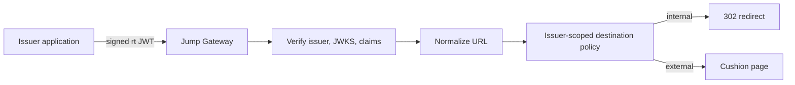
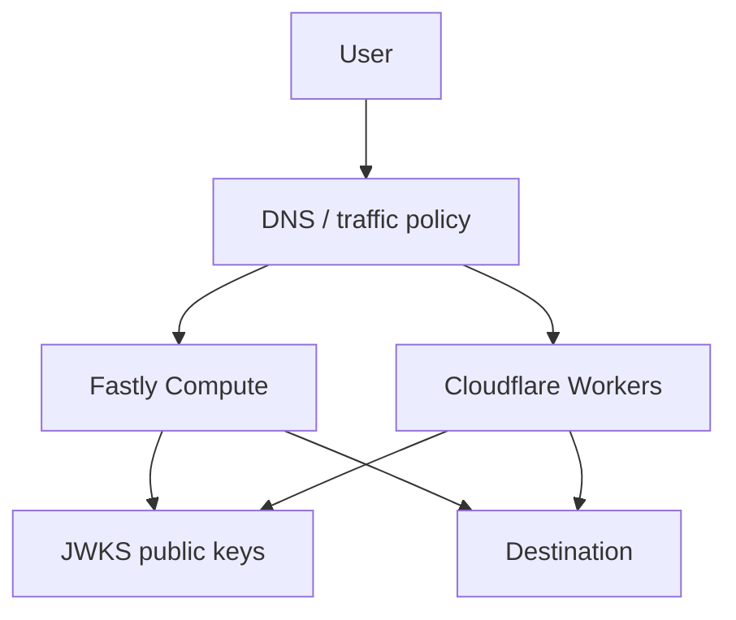

# Architecture

## Purpose

Jump is a redirect trust broker across FQDN boundaries. It receives `https://jump.example.net/?rt=<JWT>`, validates the redirect token, and decides whether the destination is allowed.

Jump exists because direct redirects are easy to turn into OpenRedirect bugs. A source application should not send users across domains based only on a raw query parameter. Jump makes the decision explicit, signed, issuer-scoped, and auditable.

## NON-GOALS

- This project is NOT an authentication provider.
- This project is NOT a session manager.
- This project is NOT a generic proxy.
- This project is NOT a URL shortener.
- This project is NOT a confidential transport.
- This project does NOT hide redirect destinations.
- This project does NOT replace OAuth/OIDC.
- This project is ONLY a redirect trust broker across FQDN boundaries.

## Trust Broker Flow

## Why Direct Redirect Is Forbidden

External direct redirects hide the decision point from users and make phishing failures harder to notice. Jump always renders a cushion page for `dst=external`; the user sees the punycode hostname and the escaped destination URL before continuing.

Internal redirects are allowed only when the issuer registry explicitly allows the normalized origin.

## Why JWT/JWKS

JWT compact JWS gives issuers a portable signed redirect decision. JWKS lets Jump verify issuer keys without sharing private keys with Jump. Token-provided key URLs are forbidden; Jump only uses registry-configured JWKS.

### Compact JWT JSON Root Contract

The decoded JOSE header and JWT payload MUST each have a JSON object as their top-level JSON value. `null`, arrays, strings, numbers, and booleans MUST be rejected as invalid client input before header field or claim validation. An empty object `{}` satisfies the root shape requirement but MUST still pass the existing required header field and claim validation.

An invalid header root uses the same internal classification as header JSON decode failure (`invalid_header`); an invalid payload root uses the same classification as payload JSON decode failure (`malformed`). Both MUST produce HTTP `400`, `X-Jump-Error: invalid_request`, no `Location` header, and `Cache-Control: no-store`. They MUST NOT produce `500 internal_error`.

Hono is the reference implementation for this contract; the Rails implementation MUST reproduce it. Candidate malformed-token vectors shared across languages are the JSON texts `null`, `[]`, `"string"`, `0`, `1`, `true`, and `false`, independently substituted into the header and payload segments. Encode each text as UTF-8 Base64URL without padding, keep the other segment a valid object (header: `{"typ":"JWT","alg":"ES384","kid":"kid-1"}`), and use `dummy-signature` as the signature segment. These cases MUST be rejected before any JWKS lookup or signature verification. Include `{}` and malformed JSON `{` as companion vectors to distinguish root shape validation from required field validation and JSON decode failure.

## Stateless Edge Design

Jump uses no cookies, DB, or sessions. The JWT contains the redirect decision, expiry, issuer, audience, `jti`, destination type, and URL. Stateless validation keeps Fastly Compute and Cloudflare Workers behavior simple and resilient.

Jump does not track `jti` consumption and permits the same redirect decision to be reused until expiry. A Jump token is navigation data only: receivers must not use it for authentication, sessions, authorization, CSRF approval, or state changes. Correctness in Jump comes from signature, claim, and policy validation.

## Active-Active Edge

Fastly and Cloudflare can both serve traffic. Runtime-specific code belongs in adapters; core logic uses Web Standard APIs where possible. Isolate-local JWKS caches are acceptable because cross-edge consistency is not a correctness requirement; replay state is not held in Jump at all.

## Implementations

The Hono code in this repository is the reference implementation and the only production path. A Rails-embedded implementation at `leap.umaxica.net` serves Rails development and test environments only. Applications select the Jump base URL by environment. See [Implementations](implementations.md).

## Why No Cookies

Cookies would create session semantics, cross-site policy questions, and extra leakage surfaces. Jump ignores `Cookie` and must not emit `Set-Cookie`.

## Security Assumptions

- Issuers protect private signing keys.
- Issuer registry entries are reviewed.
- Destination allowlists use normalized origins.
- Clocks are within configured leeway.
- `rt` is public data and may be stored by browsers or infrastructure.
